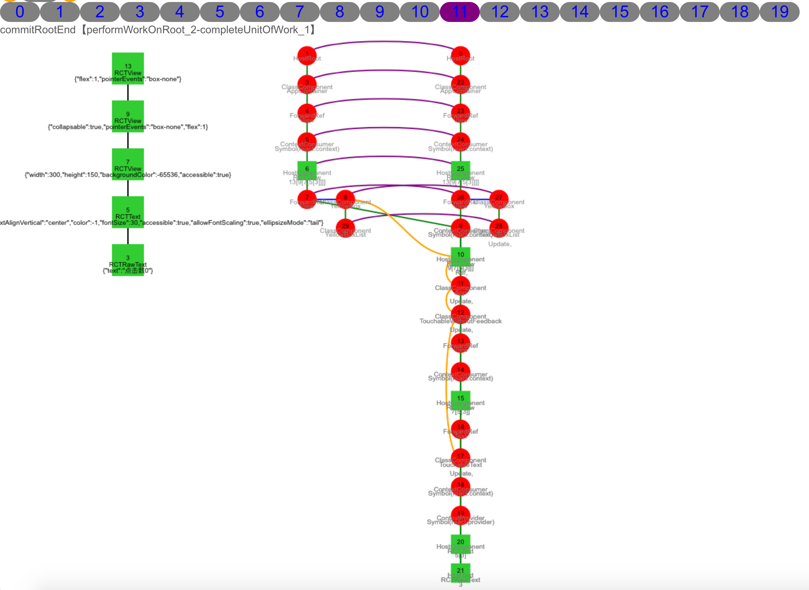
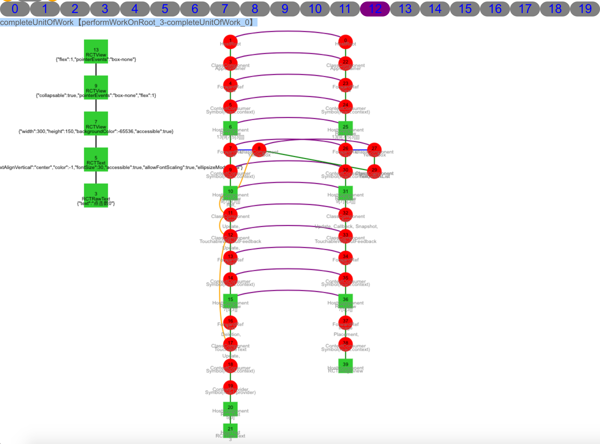
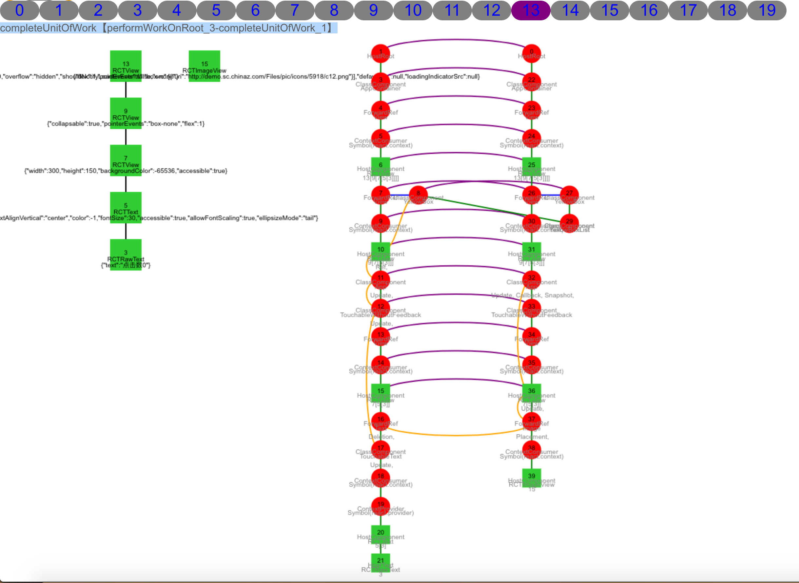
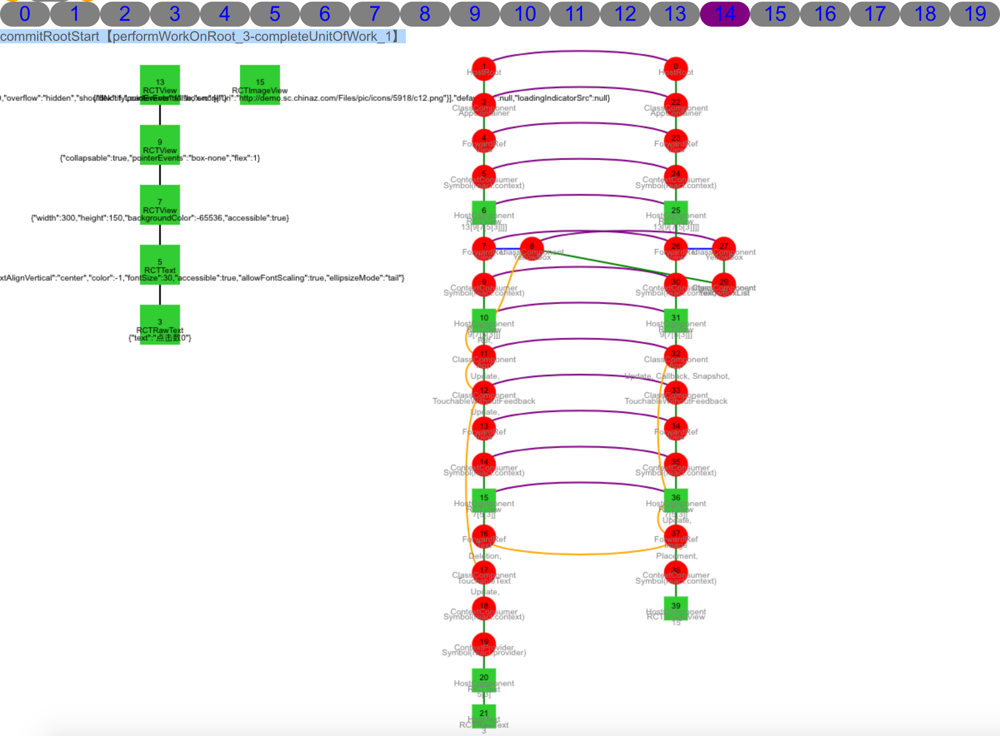
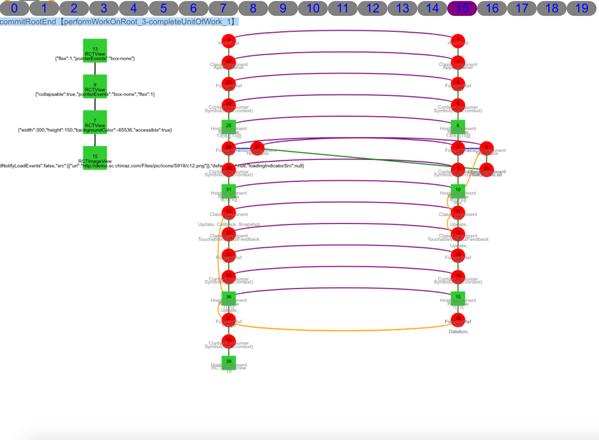
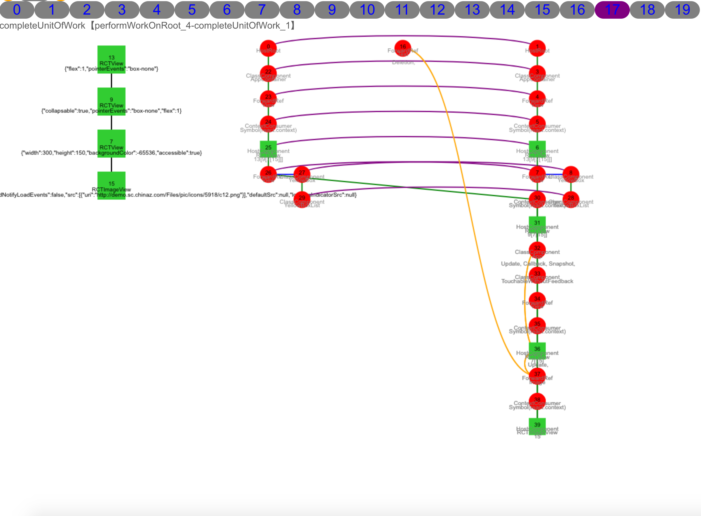
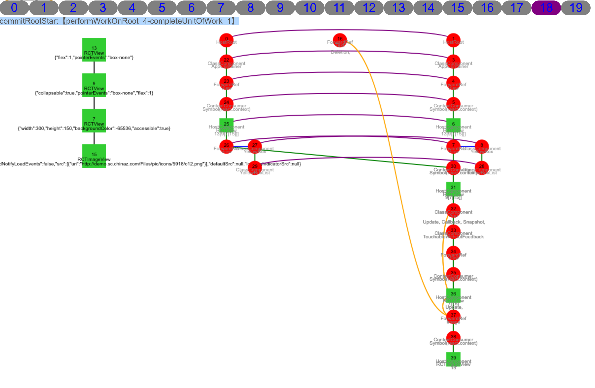
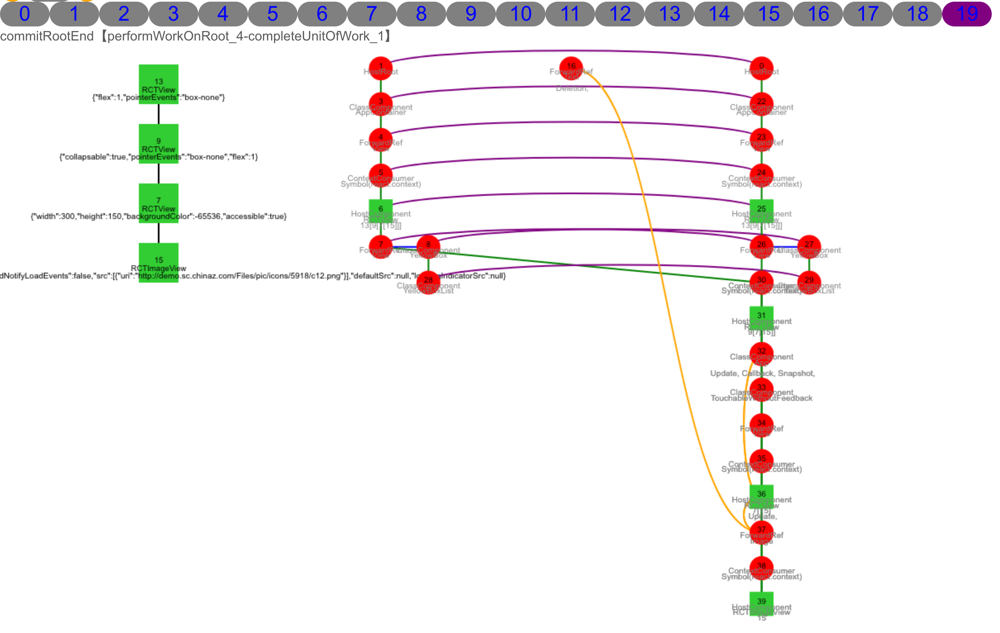

<!--# React源码解析-->
# 目录

1. 序
	2. ReactNative
	3. SCQA剖析React原理，拿到结果
2. 定目标
	3. 考考你
	4. 懂算法
	5. 攻坚方法论
3. 追过程
	4. 演进（log、debug、绘制内存数据）
	5. 讲清楚、说明白，听得懂、记得住
4. 拿结果
	4. 生命周期调用
	5. 高性能实践
	6. 问题定位利器
	5. 方法钩子

# 序

大前端趋势势不可挡，跨平台方案“小程序、Flutter”一统天下已是定局，翘楚ReactNative如日方中，不断有大公司投入大量人力物力跟进，有小试牛刀，有热火朝天，也有入门到放弃，

* 日照大海现双龙
* 记住，永远不要只满足于世界的表象，要敢于探寻未知的可能。
* 头脑活一点的童靴可能再想，能不能不还？
* 青锋剑在手，总感觉缺了点什么？
* 恨苍天不早生吾，剑道亘古如长夜。
* 如果迎着风，就飞。
* 是时候该我出手了。
* 是时候做一些好事了！
* 不懈钻研“大海航术”
* 上帝视角和时间旅行双轮驱动
* 演示diff算法区别，[React 源码剖析系列 － 不可思议的 react diff](https://zhuanlan.zhihu.com/p/20346379)
* 但是却总是好奇react的底层实现原理，多次尝试阅读react源代码都无法读下去，确实太难了。
<<<<<<< HEAD
* 参考实现自由缩放知识地图点线面事源码突围
=======
* 简约伪代码示意
>>>>>>> patch

## 流程
1. 构建组建（新建生命周期不会同时回调，所以新旧生命周期要分开）
	2. reconciliation（diff阶段）
		3. 0：创建当前根Fiber节点0，详见scheduleWorkToRoot。
		3. 1：开始工作。
		4. 2～20：深度优先遍历，依次创建工作Fiber节点1～21，详见beginWork。
			* 对于每一个工作节点，会根据tag类型调用diff算法生成对应子节点。
				* ClassComponent类型tag，会调用construct或getDerivedStateFromProps、componentWillMount、componentDidMount，render。nextChildren = instance.render()，详见updateClassComponent。
				* FunctionComponent类型tag，nextchildren=renderWithHooks()，详见updateFunctionComponent。
				* HostRoot类型tag，nextChildren = nextState.element，详见updateHostRoot。
				* HostComponent类型tag，nextChildren = nextProps.children，详见updateHostComponent。
				* HostText类型tag，空操作，详见updateHostText。
				* ForwardRef类型tag，nextChildren = renderWithHooks()，详见updateForwardRef。
				* ContextConsumer类型tag，newChildren = newProps.children()，详见updateContextConsumer。
				* ContextProvider类型tag，newChildren = newProps.children()，详见updateContextProvider。
				* 其他...
			* 设置副作用状态位effectTag。
		5. 21～34：深度优先遍历回溯，依次执行工作节点21~7操作，调用桥UIManager创建Native View 3～9。同时生成副作用链表[17, 12, 11, 10]，详见completeUnitOfWork。
			* 调用桥UIManager.createView创建Native View，调用桥UIManager.setChildren添加Native Child View。
				* HostText类型tag，创建（createTextInstance）或者更新（updateHostText$1）文本实例，详见completeWork。
				* HostComponent类型tag，创建（createInstance）&添加子节点（appendAllChildren）&添加Native子节点（finalizeInitialChildren）或者更新（updateHostComponent$1）文本实例，详见completeWork。
				* 其他...
			* 将有效副作用节点连接，生成副作用链表。
		6. 35：同4，因对应YellowBox子节点为空，故未创建工作节点。
		7. 36～41：同5，创建Native View 13。同时添加[8, 3]到副作用链表。
	8. commit(操作DOM阶段)，副作用链表[17, 12, 11, 10, 8, 3]。
		9. 42～47：提交前调用，对应生命周期getSnapshotBeforeUpdate，详见commitBeforeMutationLifecycles。

admindeMacBook-Pro-5:react-devtools-core shengshuqiang$ pwd
/Users/shengshuqiang/work/react-devtools/packages/react-devtools-core
admindeMacBook-Pro-5:react-devtools-core shengshuqiang$ yarn run standalone

admindeMacBook-Pro-5:react-devtools shengshuqiang$ pwd
/Users/shengshuqiang/work/react-devtools/packages/react-devtools
admindeMacBook-Pro-5:react-devtools shengshuqiang$ npm start

懂ReactFiber有啥用？

虽然看上去这样的算法有些“简陋”，但是其基于的是第一个假设：两个不同组件一般产生不一样的DOM结构。根据React官方博客，这一假设至今为止没有导致严重的性能问题。这当然也给我们一个提示，在实现自己的组件时，保持稳定的DOM结构会有助于性能的提升。例如，我们有时可以通过CSS隐藏或显示某些节点，而不是真的移除或添加DOM节点。

逐级拆解细化图，展开收起脑图

60？

commitAllHostEffects 第三个节点setchildren？ reactrootview
beginwork updateExpirationTime < renderExpirationTime 费解

# 考考你

1. <blockquote>问：明明只写了几个组件，通过React DevTools看到的是一堆布局，而且还有Context.Consumer，这哪来的，干啥的？ 答：查看View.js源码，发现里面会再次render出Context.Consumer。也就是我们写的<View/>最终生成的树是<blockquote>\<View><blockquote>\<Context.Consumer> \</Context.Consumer></blockquote>\</View></blockquote>。 同样，\<Text>\</Text>对应<blockquote>\<Text><blockquote>\<TouchableText><blockquote>\<Context.Consumer>\</Context.Consumer></blockquote>\</TouchableText></blockquote>\</Text></blockquote> 我们写的组件其实外面会被包裹一层，比方显示yellowbox提示啥的</blockquote>
2. <blockquote>问：React的组件和Native看起来好像不是一一对应的，这个映射策略是什么？ 答：<blockquote>1. 我们通过react-devtools看到的reactdom树不是完全的。下面是react-devtools上显示的：，文本节点没有，实际最外层还有一个HostRoot节点。</blockquote><blockquote>2. reactdom树中只有部分dom节点(宿主节点，对应文本和Native组件)是显示在界面上的，其他的并不展示。Fiber中的tag表示类型，创建NativeView时（createInstance和createTextInstance）的tag是组件唯一标识，从数字3开始累积2生成。</blockquote>。</blockquote>
3. <blockquote>问：都说React有个diffing算法，这个在代码哪里，怎么比较的，文案变了会设计diff算法吗？ 答：diffing算法在[reconciliation模块](https://zh-hans.reactjs.org/docs/reconciliation.html)里面，对应函数为ChildReconciler。，文本节点和数组见reconcileSingleTextNode和reconcileChildrenArray。更多可以参考[React 源码剖析系列 － 不可思议的 react diff](https://zhuanlan.zhihu.com/p/20346379)</blockquote>
4. <blockquote>问：浅比较shouldComponentUpdate说的是什么，到底应该怎么用？ 答：判断组件是否更新时调用，优先调用shouldComponentUpdate方法，无该该方法是判断是否是纯组件，是则浅比较（判断对象props和state前后是否改变，只对比一级属性是否严格相等===）。</blockquote>
5. <blockquote>问：React有棵DOM树，树在哪，怎么看，怎么操作Native的DOM树？ 答：。</blockquote>
6. <blockquote>问：setState到底干啥了？ 答：。</blockquote>
7. <blockquote>问：React高效在哪？ 答：可中断的树遍历算法；双树；。</blockquote>
8. <blockquote>问：React工作流程？ 答：。</blockquote>
9. <blockquote>问：如何关联Native自定义组件？ 答：。</blockquote>
10. <blockquote>问：每个Fiber节点存了什么信息，输入和输出是什么？ 答：。</blockquote>
11. 若当前一帧（16ms）内还有足够的时间就继续做下一个小任务，时间不够就停止操作，等主线程空闲时再恢复。这种停止/恢复操作，需要记录上下文信息。而当前只记录单一dom节点的vDom tree 是无法完成的，Fiber引入了fiber tree，是用来记录上下文的vDom tree怎么体现?
12. Element、Instance、DOM之间关系？
13. 在React Fiber中，一次更新过程会分成多个分片完成，所以完全有可能一个更新任务还没有完成，就被另一个更高优先级的更新过程打断，这时候，优先级高的更新任务会优先处理完，而低优先级更新任务所做的工作则会完全作废，然后等待机会重头再来。

# 背景
1. 
2.  React 组件实质是一个函数，只要是一样的输入，就会得到同样的输出组件。
2. [React Conf 2017视频观后感](https://zhuanlan.zhihu.com/p/25819975)
2. [调度算法](https://juejin.im/post/5b7016606fb9a0099406f8de)
	2. React 16版本之前使用的 Stack Reconciler 调度算法，它通过递归的形式遍历 Virtual DOM，存在难以中断和恢复的问题，如果react更新任务运行时间过长，就会阻塞布局、动画等的运行，可能导致掉帧。
	3. Fiber Reconciler允许渲染过程分段完成，而不必须一次性完成，中间可以返回至主进程控制执行其他任务，它有如下新特性：
		* 可拆分，可中断任务
		* 可重用各分阶段任务，且可以设置优先级
		* 可以在父子组件任务间前进后退切换任务
		* render方法可以返回多元素（即可以返回数组）
		* 支持异常边界处理异常
1. Fiber核心是实现了一个基于优先级和requestIdleCallback的循环任务调度算法。
11. Fiber Tree
	12. 运行时存在3种实例：
		* DOM: 真实的DOM节点。
		* Elements：主要是描述UI长什么样子(type, props)。
		* Instances: 根据Elements创建的，对组件及DOM节点的抽象表示，VDOM tree维护了组件状态以及组件与DOM树的关系。
	1. 在首次渲染过程中构建出VDOM tree，后续需要更新时(setState())，diff VDOM tree得到DOM change，并把DOM change应用(patch)到DOM树。
	2. React Fiber解决过去Reconciler存在的问题的思路是把渲染/更新过程(递归diff)拆分成一系列小任务，每次检查树上的一小部分，做完看是否还有时间继续下一个任务，有的话继续，没有的话把自己挂起，主线程不忙的时候再继续。
12. FiberNode数据结构:维护每一个分片的数据结构
	13. return, child, sibling：
	14. key: 复用标识
	15. tag：它在协调算法中用于确定需要完成的工作。如前所述，工作取决于React元素的类型。
	12. stateNode：保存组件的类实例、DOM 节点或与 Fiber 节点关联的其他 React 元素类型的引用。总的来说，我们可以认为该属性用于保持与一个 Fiber 节点相关联的局部状态。
		12. HostRoot对应{containerInfo}
		13. ClassComponent对应为new的函数对象实例
		13. HostComponent对应为ReactNativeFiberHostComponent，包含_children和_nativeTag。
		14. HostText对应为nativeTag。
	12. elementType/type: 描述了它对应的组件。对于复合组件，类型是函数或类组件本身。对于宿主组件（div，span等），类型是字符串。定义此 Fiber 节点的函数或类。对于类组件，它指向构造函数，对于 DOM 元素，它指定 HTML 标记。我经常使用这个字段来理解 Fiber 节点与哪个元素相关。
		13. ClassComponent对应为函数，如APPContainer()。
		14. ForwardRef、ContextConsumer、ContextProvider对应为对象，如{$$typeof: Symbol(react.forward_ref), render: ƒ, displayName: "View"}。
		15. HostComponent对应为字符串，如“RCTView”。
		16. HostText对应为null。
	13. memoizedProps：在前一个渲染中用于创建输出的 Fiber 的 props。
	14. memoizedState：用于创建输出的 Fiber 状态。处理更新时，它会反映当前在屏幕上呈现的状态。
	15. pendingProps：props是函数的参数。一个 fiber 的pendingProps在执行开始时设置，并在结束时设置memoizedProps。已从 React 元素中的新数据更新并且需要应用于子组件或 DOM 元素的 props。
	16. updateQueue: state更新队列。状态更新、回调和 DOM 更新的队列。
	17. firstEffect 、lastEffect 等玩意是用来保存中断前后 effect 的状态，用户中断后恢复之前的操作。这个意思还是很迷糊的，因为 Fiber 使用了可中断的架构。
	16. effectTag
	17. alternate：在调用render或setState后，会克隆出一个镜像fiber，diff产生出的变化会标记在镜像fiber上。而alternate就是链接当前fiber tree和镜像fiber tree, 用于断点恢复。workInProgress tree上每个节点都有一个effect list，用来存放需要更新的内容。此节点更新完毕会向子节点或邻近节点合并 effect list。
17. React组件渲染分为两个阶段：reconciliation（diff阶段）和 commit(操作DOM阶段)。从图上可以看到：
	* reconciler阶段是对Virtual DOM操作阶段，对应到新的调度算法中，就是找到需要更新的工作。遍历完Fiber树之后，通过Diff算法，可以产出 EffectList，给commit阶段使用。
		* reconciliation：找到需要更新的工作，通过 Diff Fiber Tree 找出要做的更新工作，这是一个js计算过程，计算结果可以被缓存，计算过程可以被打断，也可以恢复执行
		* commit：提交更新并调用对应渲染模块（react-dom）进行渲染，为了防止页面抖动，该过程是同步且不能被打断
	* render阶段是渲染阶段，拿到更新工作，在不同应用中，使用不同的渲染方式进行渲染
	* 整个函数调用流程
	* 生命周期函数汇总表
17. Context和Provider妙用。
17. instanceCache[tag] = hostInst; 缓存对应native view树的dom 树
18. instanceProps[tag] = props;
19. HostText和HostComponent才对应实体DOM节点
20.  React 中的一个组件视为一个使用 state 和 props 来计算 UI 表示的函数。
21. 副作用列表：Dan Abramov 为副作用列表提供了一个类比。他喜欢将它想象成一棵圣诞树，「圣诞灯」将所有有效节点捆绑在一起。
21. 双树结构
	21.  在第一次渲染之后，React 最终得到一个 Fiber 树，它反映了用于渲染 UI 的应用程序的状态。这棵树通常被称为 current 树（当前树）。当 React 开始处理更新时，它会构建一个所谓的 workInProgress 树（工作过程树）。
	22. 当 React 开始处理更新时，它会构建一个所谓的 workInProgress 树（工作过程树），它反映了要刷新到屏幕的未来状态。
	23. 所有工作都在 workInProgress 树的 Fiber 节点上执行。当 React 遍历 current 树时，对于每个现有 Fiber 节点，React 会创建一个构成 workInProgress 树的备用节点，这一节点会使用 render 方法返回的 React 元素中的数据来创建。处理完更新并完成所有相关工作后，React 将准备好一个备用树以刷新到屏幕。一旦这个 workInProgress 树在屏幕上呈现，它就会变成 current 树。
	21. 在React Fiber中使用了双缓冲技术(double buffering)，像redux里的nextListeners，以fiber tree为主，workInProgress tree为辅。
	22. 双缓冲具体指的是workInProgress tree构造完毕，得到的就是新的fiber tree，每个fiber上都有个alternate属性，也指向一个fiber，创建workInProgress节点时优先取alternate，没有的话就创建一个。
	23. fiber与workInProgress互相持有引用，把current指针指向workInProgress tree，丢掉旧的fiber tree。旧fiber就作为新fiber更新的预留空间，达到复用fiber实例的目的。
	24. 工作中才有双树，稳态后只维持系统容器部分的双树(不变)和用户容器的单树。
21. React和ReactDevTools通信
	21. React -> ReactDevTools
		22. React: backend.js(node_modules/react-devtools-core/build)
			23. ws.send(JSON.stringify(data));
		23. ReactDevTools: standalone.js (react-devtools-p/packages/react-devtools-core/src)
			24. socket.onmessage
			25. socket.onmessage#sendFiberTree
	22. ReactDevTools -> React: 
23. 坑爹
	24. backend.js dehydrate.js LEVEL_THRESHOLD 导致数据解析错误
25. ReactNative
	26. JavaModuleWrapper.java 
		27. mModuleHolder.getName()+ "." + ((JavaMethodWrapper) mMethods.get(methodId)).getMethod().getName() + "("+parameters.toString()+")"
		28. getName().equals("UIManager")
29. NB的架构，可扩展，不需要知道整体框架实现原理，对着其中一个功能复制黏贴即可扩展。
30. 调用关系
	31. React

1. Js2native 通信
    1. 初始态
        1. invoke    UIManager.createView    [3,"RCTRawText",11,{"text":"点击数0"}]
        2. invoke    UIManager.createView    [5,"RCTText",11,{"ellipsizeMode":"tail","allowFontScaling":true,"accessible":true,"fontSize":30,"color":-1,"textAlignVertical":"center","textAlign":"center"}]
        3. invoke    UIManager.setChildren    [5,[3]]
        4. invoke    UIManager.createView    [7,"RCTView",11,{"backgroundColor":-65536,"height":150,"width":300,"accessible":true}]
        5. invoke    UIManager.setChildren    [7,[5]]
        6. invoke    UIManager.createView    [9,"RCTView",11,{"flex":1,"pointerEvents":"box-none","collapsable":true}]
        7. invoke    UIManager.setChildren    [9,[7]]
        8. 
        9. invoke    UIManager.createView    [13,"RCTView",11,{"pointerEvents":"box-none","flex":1}]
        10. invoke    UIManager.setChildren    [13,[9]]
        11. 
        12. invoke    UIManager.setChildren    [11,[13]]
    2. 点击
        1. invoke    UIManager.measure    [7,27]
        1. invoke    UIManager.playTouchSound    []
        2. invoke    UIManager.updateView    [3,"RCTRawText",{"text":"点击数1"}]
        3. invoke    UIManager.updateView    [5,"RCTText",{"opacity":0.85}]
        4. invoke    UIManager.updateView    [7,"RCTView",{"backgroundColor":-16777216}]
        5. invoke    UIManager.updateView    [5,"RCTText",{"opacity":null}]
        6. invoke    UIManager.updateView    [7,"RCTView",{"backgroundColor":-65536}]
    1. 切换图片
        1. invoke    UIManager.measure    [7,27]
        1. invoke    UIManager.playTouchSound    []
        2. invoke    UIManager.createView    [15,"RCTImageView",11,{"loadingIndicatorSrc":null,"defaultSrc":null,"src":[{"uri":"http://demo.sc.chinaz.com/Files/pic/icons/5918/c12.png"}],"shouldNotifyLoadEvents":false,"opacity":0.85,"overflow":"hidden","height":100,"width":100}]
        3. invoke    UIManager.manageChildren    [7,[],[],[],[],[0]]
        4. invoke    UIManager.manageChildren    [7,[],[],[15],[0],[]]
        5. invoke    UIManager.updateView    [7,"RCTView",{"backgroundColor":-16777216}]
        1. invoke    UIManager.updateView    [15,"RCTImageView",{"opacity":null}]
        2. invoke    UIManager.updateView    [7,"RCTView",{"backgroundColor":-65536}]
3. Native
	4. UIManagerModule.attachRootViewToInstance
		5. 
	4. WebSocketModule.send

- renderApplication.js#renderApplication
  - ReactNativeRenderer-dev.js#render
    - updateContainer
      - scheduleRootUpdate
        - scheduleWork
          - requestWork
            - performSyncWork
              - performWork
                - performWorkOnRoot
                  - renderRoot
                    - workLoop
                      - performUnitOfWork
                        - beginWork
                          - updateHostRoot
                            - reconcileChildren
                              - reconcileSingleElement
                                - createFiberFromElement
                          - updateClassComponent
                            - constructClassInstance：创建实例
                            - mountClassInstance：挂载
                            - updateClassInstance：更新实例，判断当前是否需要重新渲染
                              - callComponentWillReceiveProps
                              - checkShouldComponentUpdate
                              - componentWillUpdate
                            - finishClassComponent：根据标识确定是否重新渲染
                              - nextChildren = instance.render()：调用render方法，生成子节点
                              - reconcileChildren
                                - reconcileChildFibers
                                  - createFiberFromElement
                          - updateForwardRef
                            - renderWithHooks
                              - children = View()
                            - reconcileChildren
                          - updateContextConsumer
                          - updateHostComponent
                            - reconcileChildren
                          - updateContextProvider
                            - reconcileChildren
                          - updateHostText
                        - completeUnitOfWork：开始回溯到有效祖先兄弟节点
                          - completeWork
                            - HostText
                              - stateNode = createTextInstance
                                - UIManager.createView()
                            - HostComponent（宿主组件，原生DOM）
                              - updateHostComponent$1
                              - instance = createInstance
                                - UIManager.createView()
                              - appendAllChildren
                              - finalizeInitialChildren
                                - UIManager.setChildren()
                            - ContextProvider
                              - popProvider
                            - ContextConsumer
                            - ForwardRef
                            - ClassComponent
                  - completeRoot
                    - commitRoot
                      - commitAllHostEffects：遍历链表直接处理
                        - PlacementAndUpdate：添加&更新
                          - commitPlacement
                            - appendChildToContainer
                              - UIManager.setChildren()
                        - Update：更新
                          - commitWork
                            - HostText
                              - commitTextUpdate
                                - UIManager.updateView()
                            - HostComponent
                              - commitUpdate
                                - UIManager.updateView()
                        - Deletion：删除
                          - commitDeletion
                            - unmountHostComponents
                              - removeChild
                                - UIManager.manageChildren（）
                        - Placement：添加
                          - commitPlacement
                            - appendChild
                              - UIManager.manageChildren（）
                      - invokeGuardedCallback
                        - commitLifeCycles
                          - ClassComponent
                            - instance.componentDidMount()
                            - instance.componentDidUpdate()
                            - commitUpdateQueue
                            - commitUpdateEffects：调用setState中callback
- 渲染树
  - HostRoot
    - HostRoot：AppContainer
      - ForwardRef：View
        - ContextConsumer：react.context
          - HostComponent：RCTView
            - ForwardRef：View
              - ContextConsumer：react.context
                - HostComponent：RCTView
                  - ClassComponent：App
                    - ClassComponent：TouchableHighlight
                      - ForwardRef：View
                        - ContextConsumer：react.context
                          - HostComponent：RCTView
                            - ForwardRef：Text
                              - ClassComponent：TouchableText
                                - ContextConsumer：react.context
                                  - ContextProvider：react.provider
                                    - HostComponent：RCTText
                                      - HostText：点击数0 (到达子节点，开始回溯到有效祖先兄弟节点)
            - YellowBox

30. 图解
	11. 初始化结束稳定态，只保留用户容器单树
	12. 
	13. 
	14. 
	15. 
	16. 
	17. 
	18. 
	19. 
20. 问题
	21. 双树什么时候互换的，current和finishwork分别对应什么？
	22. 工作内循环条件是什么？外循环呢？为什么onPress之前会触发一次外循环？
	23. 工作计数发送跳变？
	

# TODO
1. NativeModuleView支持自适应高度
2. 第一个断点处开始遍历看看如何执行？
3. commitAllHostEffects
4. 修正日志信息，继续按键state变化排查

[提供demo演示网页 ](https://supnate.github.io/react-dom-diff/index.html)
# 参考

1. [React16源码之React Fiber架构](https://github.com/HuJiaoHJ/blog/issues/7#)
2. [React Fiber架构](https://zhuanlan.zhihu.com/p/37095662)
2. [「译」React Fiber 那些事: 深入解析新的协调算法](https://juejin.im/post/5c052f95e51d4523d51c8300)
3. [浅析React Diff 与 Fiber](https://zhuanlan.zhihu.com/p/58863799)
3. [200行代码实现简版react](https://juejin.im/post/5c0c7304f265da613e22106c)
2. [React 源码剖析系列 － 不可思议的 react diff](https://zhuanlan.zhihu.com/p/20346379)
3. [React源码分析](https://juejin.im/post/5abe05ea5188255c61631d6c)
4. [[react] React Fiber 初探](https://www.cnblogs.com/qingmingsang/articles/9131512.html)
5. [Virtual DOM 的实现和 React Fiber 简介](https://www.jianshu.com/p/b189b2949b33)
6. [React中一个没人能解释清楚的问题——为什么要使用Virtual DOM](https://www.zcfy.cc/article/the-one-thing-that-no-one-properly-explains-about-react-why-virtual-dom-hashnode-1211.html)
6. [深度剖析：如何实现一个 Virtual DOM 算法 #13](https://github.com/livoras/blog/issues/13)
6. [React Fiber 架构【译】](https://blog.yongyuan.us/articles/2017-04-10-react-fiber/)
7. [React Fiber是什么](https://zhuanlan.zhihu.com/p/26027085)
5. [浅谈React16框架 - Fiber](https://blog.csdn.net/P6P7qsW6ua47A2Sb/article/details/82322033)
6. [如何理解 React Fiber 架构？](https://www.zhihu.com/question/49496872)
7. [React 16 架构研究记录（文末有彩蛋）](https://zhuanlan.zhihu.com/p/36926155)
8. [对React生命周期的理解](https://blog.csdn.net/WonderGlans/article/details/83479577)