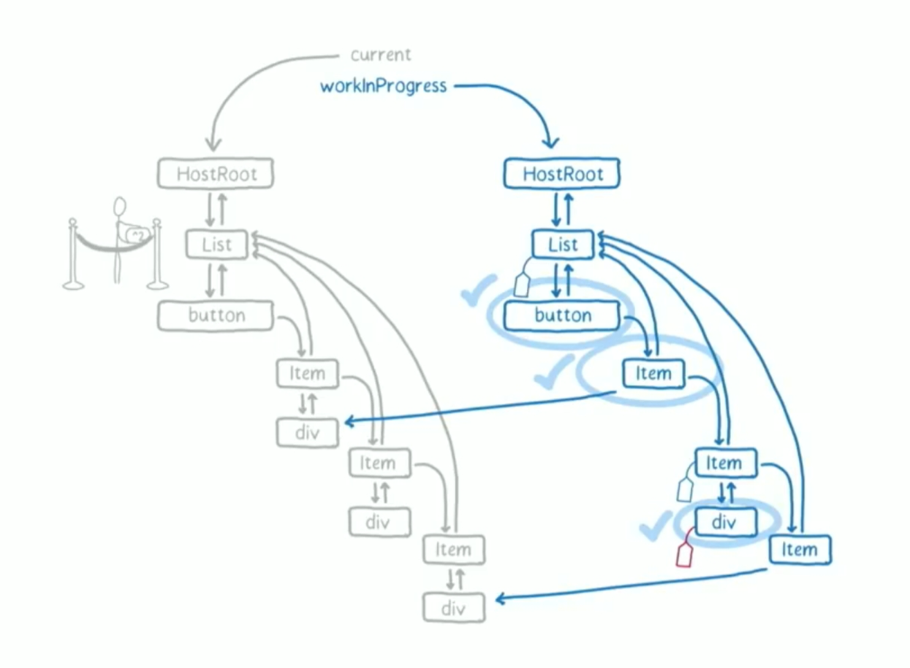
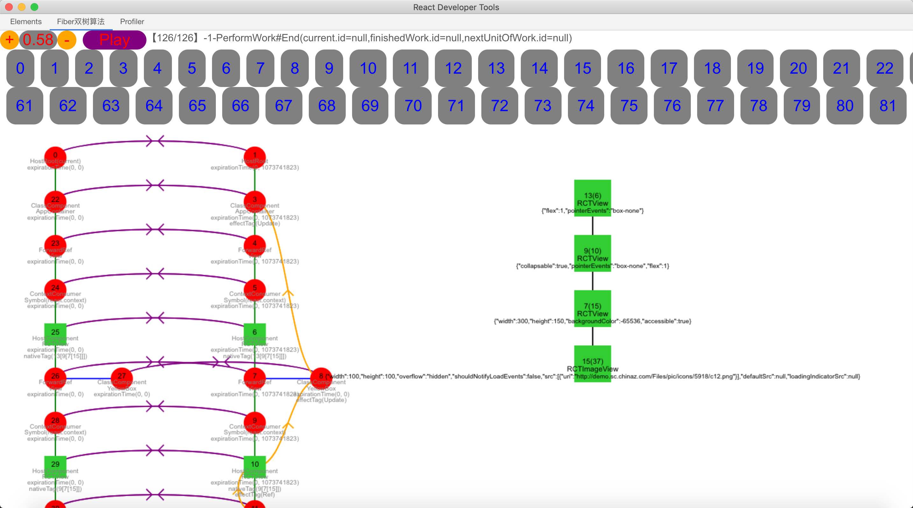
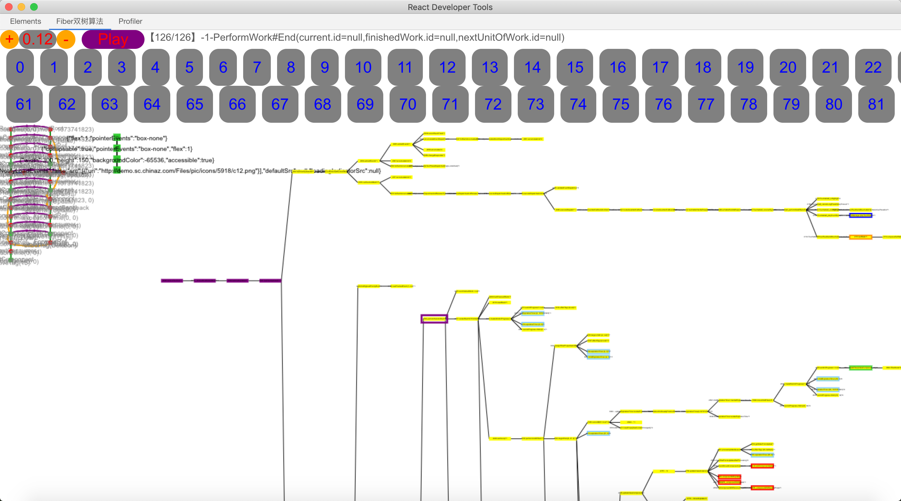

<!--# 进击ReactNative-徐如林-React源码解析-->
采扶桑 望帝乡 兵甲销为日月光

# 目录

1. 序
	2. ReactNative
	3. SCQA剖析React原理，拿到结果
2. 定目标
	3. 传道（攻坚方法论）
	4. 授业（懂算法）
	5. 解惑（考考你）
3. 追过程
	4. 演进（log、debug、绘制内存数据）
	5. 简单可依赖伪代码
	5. 讲清楚、说明白，听得懂、记得住
4. 拿结果
	4. 生命周期调用
	5. 高性能实践
	6. 问题定位利器
	5. 方法钩子

# 序

有的人可能会不理解，一统大前端跨平台解决方案的战火为谁而燃，吾辈何以而战？专注于移动互联网大前端致富，一直是我们最崇高的理想，而ReactNative是一个桥头堡。纵观行业风向，有作壁上观者，有磨刀霍霍者，有入门到放弃者，有大刀阔斧者，但是缺乏深潜微操者。哈，是时候该我出手了。祭出“大海航术”，经过一年来不懈钻研，基于React Developer Tools研发插件，自动监控绘制运行时三张图--Fiber双树图、Native View树图、React方法调用树图，在上帝视角和时间旅行的引领下，冲破波诡云谲的Fiber迷航，重现昔日的荣耀--日照大海现双龙。

如果有对ReactNative不太熟悉的朋友，可以看一下我上篇文章[《进击ReactNative-疾如风》](https://shengshuqiang.github.io/2019/01/07/%E8%BF%9B%E5%87%BBReactNative-%E7%96%BE%E5%A6%82%E9%A3%8E.html)润润嗓子，该文从“原理+实践，现学现做”的角度手写石器时代ReactNative，了解整体跨平台套路，目的是先学会怎么用，再去想为什么！本文则进击React源码。

做大事，就要用大斧头。先用[阿里“三板斧”](https://baijiahao.baidu.com/s?id=1609462546639223406&wfr=spider&for=pc)撼一下。

# 定目标


## 传道（攻坚方法论）

近几年移动互联网北漂，让我明白一个道：所谓经验，就是不断探索、抽象、践行、强化自己的方法论——发展的螺旋形式，“复盘总结”一直是茁壮成长的牛人居家旅行必备技能。我攻坚ReactNative的最大动力，就是借假修真，跨平台技术最终王者也许花落Flutter或者小程序（还有很多人在纠结到底哪家强，耽误了学习，其实这好比考清华还是考北大，Top2高校有那么难选么，真正难选的是Top3高校），这都都不重要，我能举一，必能反三。这就是道，我旨在强化出一套跨界喜剧王的方法论，如何从0将ReactNative技能练到Android熟练度，并且同样适用于Flutter和小程序。


## 授业（懂算法）

阅读源码的好处不言而喻，源码是唯一的真相和注释，无意间你发现了还有其他骚操作，关键还不花钱。记得我刚入行时，我问导师乔璞学习Android要看哪些书，导师乔璞说，看Google官方文档和源码就足够了，其他的那些书都是抄官方文档的。现在市面上高水准深度解析ReactNative文章比较少，而且大多停留在理论层面，只给出源代码片段，根本无法深入实操，只能作者说啥就是啥，反正不明觉厉。


本文必须带你看到源码但不是做英语阅读，尽量做到：

1. 承上（你的api怎么用的）
	* 生命周期调用时机
	* render干了什么
	* setState发生了什么
	* PureComponent比Component高在哪里，我们怎么能做到更高
1. 启下（底层怎么处理的）
	* 深入浅出Fiber双树算法
	* diff算法
	* Native操作指令从哪来的

## 解惑（考考你）

爱思考的童靴会发现各种各样的问题，我也是？下面是我遇到的问题，我需要一个满意的答复。

1. 明明只写了几个组件，通过React Developer Tools看到的是一堆布局，而且还有Context.Consumer，这些都是干啥的，React组件和Native View映射策略是什么？
2. Element、Instance、DOM之间关系？
2. 都说React有个diffing算法，这个在代码哪里，怎么比较的，文案变了会涉及diff算法吗？
3. 浅比较shouldComponentUpdate说的是什么，到底应该怎么用？
4. React有棵DOM树，树在哪，怎么看，怎么操作Native的DOM树？
5. setState到底干啥了？
6. React高效在哪？
7. React工作流程？
8. 如何关联Native自定义组件？
9. 每个Fiber节点存了什么信息，输入和输出是什么？


# 追过程

## 三步曲

### 第一步（查资料）

网上一顿关键字搜索，站在前人的肩膀上，知道个大概，不要急，妥妥的数十篇深度文章以上，你的感觉才能来。这里给大家安利三篇文章（ReactNative优秀文章导读）和一个微信朋友圈。没错，就是我，不一样的烟火。发盆友圈，我是认真的。前面三篇文章是我盆友圈的汇集，这么说吧，发盆友圈是停不下来了，上一天班我就发一篇。

1. [进击ReactNative-纳百川](https://shengshuqiang.github.io/2018/12/15/%E8%BF%9B%E5%87%BBReactNative-%E7%BA%B3%E7%99%BE%E5%B7%9D.html)
2. [进击ReactNative-积土（React）山](https://shengshuqiang.github.io/2019/01/20/%E8%BF%9B%E5%87%BBReactNative-%E7%A7%AF%E5%9C%9F-React-%E5%B1%B1.html)
3. [进击ReactNative-积水（JavaScript）渊](https://shengshuqiang.github.io/2019/02/24/%E8%BF%9B%E5%87%BBReactNative-%E7%A7%AF%E6%B0%B4-JavaScript-%E6%B8%8A.html)
4. 点右上角[“关于”](https://shengshuqiang.github.io/about.html)加我微信，欢迎切磋技艺

给大家分享一下，18年我主要是在早上地铁通勤时手机看技术文章，然后到公司10分钟总结发一下，顺带练习一下抓重点。19年初工作鸭梨大，中断了一段时间，现在已经满血回蓝，接着干。发现，回不去了，地铁上看不下去，索性换个时间，早上起来用电脑看，半小时就发盆友圈。我观察过，7点左右发点赞数最多，《朝闻天下》7：00播出就是这个道理。

《中庸》上说，“人一能之己百之，人十能之己千之。果能此道矣，虽愚必明，虽柔必强。”书看多了，感觉也就有了，优势和自信也就来了，于是，你看到了希望，眼里有光。不间断的阅读输出，能不断获得启发，有助于修正强化方法论。比方说通过XMind自由缩放源码地图、DIY ReactNative、抽象伪代码表述等。过程中，我发现大家都在用一个卡通图。



卡通图来源React的美女程序员Lin Clark在2017年React大会的演讲视频截图，这个视频太棒了，建议大家看一看[Lin Clark - A Cartoon Intro to Fiber - React Conf 2017](https://www.bilibili.com/video/av40427580/)。

当然了，干打鸡血只能一时鸡血一时爽，一直鸡血的话，会迷失自己，一旦装不下去了，鸡血一停，妥妥滴至暗时刻，如果走不出来，就成自闭症了。其实，这是我瞎说的，我又不是医生【^_^】。当然，里面也有科学理论支持，毕竟我浸淫移动互联网大厂也有些年头了，没吃过猪肉但看过猪飞起来。


### 第二步（搭台子）

搭一个实验室--本地可运行环境（我的开发平台macOS，目标平台Android）。

1. 安装软件：Webstorm（前端开发环境）、AndroidStudio（Android开发环境，送Android模拟器）
2. 安装依赖：安装XCode（iOS开发环境，送iPhone模拟器）就顺带解决了
2. 使用 React Native 命令行工具来创建一个名为"AwesomeProject"的新项目：react-native init AwesomeProject
3. 欧了，简单demo(页面一个红色按钮，初始显示点击数n，点击切换为“汽车”图标)测试一下。
4. 
5. 配置详见[React Native 中文网-搭建开发环境](https://reactnative.cn/docs/getting-started.html)

### 第三步（上阔乐）

程序猿不抽烟，不饮酒，但是阔乐可以有。就着阔乐，我们来读源码（ "react": "16.8.3","react-native": "0.59.8"）吧。

ReactNative上层JS代码主要实现在node_modules/react-native/Libraries/Renderer/oss/ReactNativeRenderer-dev.js这一个文件，代码行数21194（能看到这一行的读者，最起码是10W+的代码量，区区2W，好像挑战也没辣么大）。


读源码，需要有一定的内力，记得刚实习的时候读SIP协议栈实现源码，咪着眼睛摸着石头过河，磕得一脸狗血，看得我羡慕门口的保安工作。凡事都有个过程，随着日月如梭，读码，我已然也是一把好手。论定力，我佩服乔璞导师和杨光乐同学，根本耗不过他们，一动不动都不带上厕所的，就问你憋不憋得住。

我给自己的撸码方法论起了个响亮又洋气的名字--“大海航术”，简单说就是运行时日志辅助断点调试，再加上自己野兽般的想象力，达到能自圆其说，唬住不懂的人（包括我自己），假装懂了的套路。用龙四的话讲，“其实千术讲究领悟力，即一点就明”。

对付简单的算法，这招基本够用，否则我也混不下去了。但是，Fiber算法，可不是这么想的。第一个回合硬着头皮看下来，只知道一堆乱七八糟的调用，混杂着Fiber数据结构中的各种光怪陆离的属性，而且用到了复杂的双树形结构，这些，小本子根本记不过来。来张我的笔记感受一下（不用细看，我也没打算讲这张图），一波操作下来，差不多要2天专注的投入，要是打断了，你都找不到北。


按这个套路，连Log加Debug带猜，发现装不下去了，这道题太难了。一度跌入绝望之谷。即使这样，我仍然尝试把源码看了三遍，仍然没什么大的收获，等着顿悟吧，直到那一天。。。

细心的朋友会发现，现在早上地铁通勤不走技术流了，那干啥呢？我在看国家大事【没想到吧】，关注了“九边”、“卢克文工作室”公众号，写的是我一直在苦苦寻找的国际历史、政治、经济视角下的国家和民族利益。

[《读懂圣殿骑士团，读懂现代银行的起源》](https://mp.weixin.qq.com/s?__biz=MzUzMjY0NDY4Ng==&mid=2247483854&idx=1&sn=bd82089baec16c3b7d2e96d57e8e5840&chksm=fab157efcdc6def9b4a890ba7894b6c440fd4b38923810f6bc27cbc71b549081e3c92c05328d&mpshare=1&scene=1&srcid=1020RvqHBV8LgoFciquJ4koA&sharer_sharetime=1571535764572&sharer_shareid=82c707e9022f9f44af256194c6fc9b1f&pass_ticket=PNCtDJj79ATAfJb0AYzGIeOribtLxFVNeuVyR9kwmBPpNQoMX6K0qv0q3H5sYMDq#rd)里面有个有意思的小故事，说欧洲国王和圣殿骑士团（从事有点像我国的镖局和钱庄的早期银行业务）借钱打战，打赢了就把钱换上，关键好几次打输了，欠了一屁股债，脑子很活的法国国王就想：“可不可以不还钱”，随后的问题就是“不还钱会发生啥？”，进一步“不仅不还钱，而且杀鸡取卵，有问题吗？”能有啥问题，没问题，那就干。然后说圣殿骑士团搞基（因为圣殿骑士团徽章是两个人骑一匹马，原因就这么单纯朴素）犯法，于是砍死了债主，钱也就不用还了。

我受到了启发，也来个脑筋急转弯，能不能自己写个脚本把Fiber双树画出来，日志理论上的确记录了算法的所有行为，但问题是可读性太差，上万条日志能联系起来推理，猴哥都不一定能做到，况且我们又不是猴子，是时候生产工具鸟枪换炮了。说干就干，我将日志中的Fiber双树用JS脚本画了出来。

[](./DrawFiber/drawfiber.html)

上面Demo，初始化渲染有60步，我这么一步步复制数据生成Fiber树图片，这和猴子也没啥区别。这时，我想起来了好基友李阳推荐的React Developer Tools工具、恰巧彼时团队内部也在扩展该工具。我能不能写个插件，实时监控绘制运行时Fiber双树图。虽说是扩大战果，但也可能被拖入新的泥潭，舍本逐末。幸好，上帝这次又站在我这边，在瓶颈期通过董思文和陈卓双大牛的点拨下，插件也给我搞出来了（这份骄傲我还是有的）。



这里面不得不给React Developer Tools点个赞，这是我迄今见过最好的架构，我就一JS倔强青铜的水平，竟然看着文档能把源码跑起来（过程中编译相关小问题找大牛给解了），进一步把自己的脚本集成进去，模仿已有脚本一顿Ctrl+F、Ctrl+C、Ctrl+V就成了，延展性可见一斑，你说这架构牛不牛皮，服不服?

上面截图可以看到，插件里面有两棵树（Fiber双树和Native View树）和一堆数字按钮。数字按钮对应每一步，点击按钮即可完成时间旅行。光凭这两颗树，还是要靠日志像猴子一样手动映射源码，我才不做猴子呢。在此之上，我更上一层，绘制实时方法调用树（看着有点像抽象语法树，但是如此应用，我是缔造者）。



## 大海航术

终于到了压轴环节，上大海航术动图。


受限于屏幕大小，无法鸟瞰全貌，后续考虑直接生成一个网页。

React源码解析，需要牢记：React组件是数据的函数，v = f(d)。抓住输入和输出，才能有的放矢。本次解析分为二段，初始渲染时间线（用户进入页面Fiber算法干啥类）、用户点击渲染时间线（用户点击按钮切换文本为图标，Fiber算法又干啥类）。这两个场景是所有Fiber算法行为的本源，万变不离其宗。然后再用简单伪代码回顾一下。

### 初始渲染时间线

**初始化页面布局**(里面有一堆组件，远比我们写的要多)


**初始化JS2Native通信**(通信主要是通过桥UIManager调用createView创建、setChildren关联（增删改）和updateView更新)

	1. invoke    UIManager.createView    [3,"RCTRawText",11,{"text":"点击数0"}]
	2. invoke    UIManager.createView    [5,"RCTText",11,{"ellipsizeMode":"tail","allowFontScaling":true,"accessible":true,"fontSize":30,"color":-1,"textAlignVertical":"center","textAlign":"center"}]
	3. invoke    UIManager.setChildren    [5,[3]]
	4. invoke    UIManager.createView    [7,"RCTView",11,{"backgroundColor":-65536,"height":150,"width":300,"accessible":true}]
	5. invoke    UIManager.setChildren    [7,[5]]
	6. invoke    UIManager.createView    [9,"RCTView",11,{"flex":1,"pointerEvents":"box-none","collapsable":true}]
	7. invoke    UIManager.setChildren    [9,[7]]
	8. 
	9. invoke    UIManager.createView    [13,"RCTView",11,{"pointerEvents":"box-none","flex":1}]
	10. invoke    UIManager.setChildren    [13,[9]]
	11. 
	12. invoke    UIManager.setChildren    [11,[13]]


**初始化Fiber树**


**初始化NativeView树**


**手机横过来看**

[	](./React算法初始渲染时间线-横版.png)

### 用户点击渲染时间线

**用户点击页面组件布局**


**用户点击JS2Native通信**，

    1. invoke    UIManager.measure    [7,27]
    1. invoke    UIManager.playTouchSound    []
    2. invoke    UIManager.createView    [15,"RCTImageView",11,{"loadingIndicatorSrc":null,"defaultSrc":null,"src":[{"uri":"http://demo.sc.chinaz.com/Files/pic/icons/5918/c12.png"}],"shouldNotifyLoadEvents":false,"opacity":0.85,"overflow":"hidden","height":100,"width":100}]
    3. invoke    UIManager.manageChildren    [7,[],[],[],[],[0]]
    4. invoke    UIManager.manageChildren    [7,[],[],[15],[0],[]]
    5. invoke    UIManager.updateView    [7,"RCTView",{"backgroundColor":-16777216}]
    1. invoke    UIManager.updateView    [15,"RCTImageView",{"opacity":null}]
    2. invoke    UIManager.updateView    [7,"RCTView",{"backgroundColor":-65536}]

**用户点击Fiber树**


**初始化NativeView树**


**手机横过来看**

[](./React算法用户点击渲染时间线-横版.png)

### 惊回首

#### 简约伪代码示意

```
function ReactNativeRenderer_render() {
    const ClassComponent = 1;
    const HostComponent = 5;
    const HostText = 6;
    const Snapshot = 256;
    const Placement = 2;
    const Update = 4;
    const PlacementAndUpdate = 6;
    const Deletion = 8;

    const root = {};
    const {current, workInProgress, rootContainerInstance} = root;
    let {nextUnitOfWork, nextEffect} = root;
    const {oldProps, newProps, oldState, newState, oldContext, newContext} = workInProgress;
    /** performWorkOnRoot */
    {
        /** renderRoot */
        {
            // 深度优先遍历完所有Fiber节点
            /** workLoop */
            {
                while (nextUnitOfWork !== null) {
                    /** performUnitOfWork */
                    {
                        /** beginWork */
                        {
                            // 判断数据是否变化（属性相关）
                            const hasDataChanged = {}
                            // 数据没有变化，则直接当前Fiber节点克隆出工作Fiber节点，详见bailoutOnAlreadyFinishedWork
                            const bailoutOnAlreadyFinishedWork = function (workInProgress) {
                            };
                            if (!hasDataChanged) {
                                nextUnitOfWork = bailoutOnAlreadyFinishedWork(workInProgress);
                            } else {
                                // 数据变化，重新创建Fiber节点
                                /** updateXXX */
                                switch (workInProgress.tag) {
                                    case ClassComponent: {
                                        /** updateClassComponent
                                         * 调用生命周期，新旧取决于用于在类里面增加的方法是新还是旧，
                                         * 如果都有则只调用新的，新生命周期对应construct->getDerivedStateFromProps->render，
                                         * 旧生命周期对应construct->componentWillMount->UNSAFE_componentWillMount->render。
                                         * nextChildren = instance.render()
                                         * */
                                        {
                                            let instance = workInProgress.stateNode;
                                            // 根据是否有新生命周期方法判断是否要调用旧生命周期
                                            const ctor = workInProgress.type;
                                            const getDerivedStateFromProps = ctor.getDerivedStateFromProps;
                                            const hasNewLifecycles = ctor.getDerivedStateFromProps && instance.getSnapshotBeforeUpdate;
                                            if (instance === null) {
                                                // 初始创建
                                                /** constructClassInstance */
                                                {
                                                    // 调用construct实例化组件
                                                    instance = new ctor();
                                                }
                                                /** mountClassInstance */
                                                {
                                                    /** applyDerivedStateFromProps */
                                                    {
                                                        // 调用新生命周期getDerivedStateFromProps
                                                        getDerivedStateFromProps(newProps, oldState);
                                                    }

                                                    if (!hasNewLifecycles) {
                                                        // 调用旧生命周期
                                                        /** callComponentWillMount */
                                                        {
                                                            // 调用旧生命周期componentWillMount
                                                            instance.componentWillMount();
                                                            instance.UNSAFE_componentWillMount();
                                                        }
                                                    }
                                                }
                                            } else {
                                                // 已存在，则diff更新(为了简化，忽略resumeMountClassInstance)
                                                /** updateClassInstance */
                                                {
                                                    // 更新实例
                                                    let shouldUpdate;
                                                    const hasPropsChanged = oldProps !== newProps || oldContext !== newContext;
                                                    if (!hasNewLifecycles && hasPropsChanged) {
                                                        // 无新生命周期且属性变化
                                                        /** callComponentWillReceiveProps */
                                                        {
                                                            // 调用旧生命周期componentWillReceiveProps
                                                            instance.componentWillReceiveProps(newProps, newContext);
                                                            instance.UNSAFE_componentWillReceiveProps(newProps, newContext);
                                                        }
                                                    }

                                                    /** applyDerivedStateFromProps */
                                                    {
                                                        // 调用新生命周期getDerivedStateFromProps
                                                        getDerivedStateFromProps(newProps, oldState);
                                                    }

                                                    /** checkShouldComponentUpdate */
                                                    {
                                                        if (instance.shouldComponentUpdate) {
                                                            // 刷新逻辑交个用户控制，也就是大家说的高性能操作
                                                            shouldUpdate = instance.shouldComponentUpdate(newProps, newState, newContext);
                                                        } else if (ctor.prototype.isPureReactComponent) {
                                                            // 纯组件，进行浅比较判断是否刷新
                                                            const shallowEqual = function () {
                                                            };
                                                            shouldUpdate = !shallowEqual(oldProps, newProps) || !shallowEqual(oldState, newState);
                                                        } else {
                                                            // 普通组件，直接刷新
                                                            shouldUpdate = true;
                                                        }
                                                    }

                                                    if (shouldUpdate) {
                                                        if (!hasNewLifecycles) {
                                                            // 调用旧生命周期componentWillUpdate
                                                            instance.componentWillUpdate(newProps, newState, newContext);
                                                            instance.UNSAFE_componentWillUpdate(newProps, newState, newContext);
                                                        }
                                                    }
                                                }
                                            }
                                            /** finishClassComponent */
                                            {
                                                if (!shouldUpdate) {
                                                    nextUnitOfWork = bailoutOnAlreadyFinishedWork(workInProgress);
                                                } else {
                                                    const nextChildren = instance.render();
                                                    /** reconcileChildFibers
                                                     * 硬核diff算法
                                                     * */
                                                    {
                                                        const isObject = typeof nextChildren === "object" && nextChildren;
                                                        if (isObject) {
                                                            /** reconcileSingleElement */
                                                            {
                                                                if (workInProgress) {
                                                                    // 判断key是否相等
                                                                    const isKeyEquals = workInProgress.key === nextChildren.key;
                                                                    if (isKeyEquals) {
                                                                        // 判断类型是否相同
                                                                        const isTypeEquals = child.elementType === nextChildren.type;
                                                                        if (isTypeEquals) {
                                                                            // diff算法:类型相同,复用子节点树&删除子节点兄弟树
                                                                            (function deleteRemainingChildren(sibling) {
                                                                            })(workInProgress.sibling);
                                                                            workInProgress.child = (function useFiber(workInProgress) {
                                                                            })(workInProgress);
                                                                        } else {
                                                                            // diff算法:类型不相同,删除全部子节点树
                                                                            (function deleteRemainingChildren(sibling) {
                                                                            })(workInProgress);
                                                                            // diff算法:新建子节点
                                                                            workInProgress.child = (function createFiberFromElement(nextChildren) {
                                                                            })(nextChildren);
                                                                        }
                                                                    } else {
                                                                        // diff算法:key不同,删除子节点树
                                                                        (function deleteChild(sibling) {
                                                                        })(workInProgress);
                                                                        // diff算法:新建子节点
                                                                        workInProgress.child = (function createFiberFromElement(nextChildren) {
                                                                        })(nextChildren);
                                                                    }
                                                                }
                                                            }
                                                        } else {
                                                            /** 暂时忽略 */
                                                            // string、number
                                                            // array
                                                            // iterator
                                                            // undefined
                                                            // deleteRemainingChildren(returnFiber, currentFirstChild)
                                                        }
                                                    }
                                                    nextUnitOfWork = workInProgress.child;
                                                }
                                            }
                                        }
                                        break;
                                    }
                                    default:
                                        /** 忽略，不重要 */
                                        break;
                                }
                            }
                            nextUnitOfWork = beginWork(current$$1, workInProgress, nextRenderExpirationTime);
                        }
                        if (nextUnitOfWork === null) {
                            {
                                /** completeUnitOfWork
                                 *  深度优先遍历回溯，调用桥UIManager创建&连接Native View。
                                 *  同时生成副作用链表。
                                 *  */
                                while (true) {
                                    // nextUnitOfWork = completeWork(
                                    /** completeWork */
                                    {
                                        switch (workInProgress.tag) {
                                            case HostComponent: {
                                                // 是否已实例化
                                                const hasInstance = current && workInProgress.stateNode != null;
                                                if (hasInstance) {
                                                    /** updateHostComponent$1 */
                                                    {
                                                        if (oldProps !== newProps) {
                                                            const updatePayload = (function prepareUpdate(workInProgress) {
                                                            })(workInProgress);
                                                            workInProgress.updateQueue = updatePayload;
                                                        }
                                                    }
                                                } else {
                                                    let instance;
                                                    const tag = (function allocateTag() {
                                                    })();
                                                    const ReactNativeViewConfigRegistry = function () {
                                                    };
                                                    const viewConfig = ReactNativeViewConfigRegistry.get(workInProgress);
                                                    const updatePayload = create(props, viewConfig.validAttributes);
                                                    /** createInstance */
                                                    {
                                                        UIManager.createView(
                                                            tag, // reactTag
                                                            viewConfig.uiViewClassName, // viewName
                                                            rootContainerInstance, // rootTag
                                                            updatePayload // props
                                                        );

                                                        function ReactNativeFiberHostComponent() {
                                                        };
                                                        instance = new ReactNativeFiberHostComponent(tag, viewConfig)
                                                    }
                                                    /** appendAllChildren */
                                                    {
                                                        (function appendAllChildren(workInProgress) {
                                                        })(workInProgress);
                                                    }
                                                    /** finalizeInitialChildren */
                                                    {
                                                        const {parentInstance, nativeTags} = workInProgress;
                                                        UIManager.setChildren(
                                                            parentInstance._nativeTag, // containerTag
                                                            nativeTags // reactTags
                                                        );
                                                    }
                                                }
                                            }
                                                break;
                                            case HostText: {
                                                // 是否已实例化
                                                const hasInstance = current && workInProgress.stateNode != null;
                                                const {oldText, newText} = [oldProps, newProps];
                                                if (hasInstance) {
                                                    /** updateHostText$1 */
                                                    {
                                                        if (oldText !== newText) {
                                                            /** createTextInstance */
                                                            {
                                                                const tag = (function allocateTag() {
                                                                })();

                                                                UIManager.createView(
                                                                    tag, // reactTag
                                                                    "RCTRawText", // viewName
                                                                    rootContainerInstance, // rootTag
                                                                    {text: newText} // props
                                                                );
                                                                workInProgress.stateNode = tag;
                                                            }
                                                        }
                                                    }
                                                } else {
                                                    /** createTextInstance */
                                                    {
                                                        const tag = (function allocateTag() {
                                                        })();

                                                        UIManager.createView(
                                                            tag, // reactTag
                                                            "RCTRawText", // viewName
                                                            rootContainerInstance, // rootTag
                                                            {text: newText} // props
                                                        );
                                                        workInProgress.stateNode = tag;
                                                    }
                                                }
                                            }
                                                break;
                                            default:
                                                /** 忽略 */
                                                break;
                                        }
                                    }
                                    if (nextUnitOfWork !== null) {
                                        return nextUnitOfWork;
                                    }
                                    /** 自底向上归并有效副作用节点，连接成副作用链表 */
                                }
                                nextUnitOfWork = completeUnitOfWork(workInProgress);
                            }
                        }
                    }
                }
            }
        }
        const {finishedWork} = root;
        const {firstEffect} = finishedWork;
        if (finishedWork !== null) {
            /** completeRoot */
            {
                const instance = finishedWork.stateNode;
                /** commitRoot */
                {
                    nextEffect = firstEffect;
                    while(nextEffect) {
                        /** commitBeforeMutationLifeCycles */
                        {
                            switch (finishedWork.tag) {
                                case ClassComponent:
                                    {
                                        if (finishedWork.effectTag & Snapshot) {
                                            // 调用新生命周期getSnapshotBeforeUpdate
                                            instance.getSnapshotBeforeUpdate(oldProps, oldState);
                                        }
                                    }
                                    break;
                                default:
                                    // 忽略
                                    break;
                            }
                        }
                        nextEffect = nextEffect.nextEffect;
                    }

                    nextEffect = firstEffect;
                    while(nextEffect) {
                        /** commitAllHostEffects */
                        {
                            var {effectTag} = nextEffect;
                            var primaryEffectTag = effectTag & (Placement | Update | Deletion);
                            switch (primaryEffectTag) {
                                case Placement:
                                    {
                                        /** commitPlacement */
                                        {
                                            const {containerID, moveFromIndices, moveToIndices, addChildReactTags, addAtIndices, removeAtIndices} = finishedWork;
                                            UIManager.manageChildren(containerID, moveFromIndices, moveToIndices,addChildReactTags,addAtIndices,removeAtIndices);
                                        }
                                    }
                                    break;
                                case PlacementAndUpdate:
                                    {
                                        /** commitPlacement */
                                        {
                                            const {containerID, moveFromIndices, moveToIndices, addChildReactTags, addAtIndices, removeAtIndices} = finishedWork;
                                            UIManager.manageChildren(containerID, moveFromIndices, moveToIndices,addChildReactTags,addAtIndices,removeAtIndices);
                                        }
                                        /** commitWork */
                                        {
                                            switch (finishedWork.tag) {
                                                case HostComponent:
                                                    {
                                                        /** commitUpdate */
                                                        const {reactTag, viewName, props} = finishedWork;
                                                        UIManager.updateView(reactTag, viewName, props);
                                                    }
                                                    break;
                                                case HostText:
                                                    {
                                                        /** commitTextUpdate */
                                                        const {reactTag, props} = finishedWork;
                                                        UIManager.updateView(reactTag, "RCTRawText", props);
                                                    }
                                                    break;
                                                default:
                                                    // 忽略
                                                    break;
                                            }
                                        }
                                    }
                                    break;
                                case Update:
                                    {
                                        /** commitWork */
                                        {
                                            switch (finishedWork.tag) {
                                                case HostComponent:
                                                    {
                                                        /** commitUpdate */
                                                        const {reactTag, viewName, props} = finishedWork;
                                                        UIManager.updateView(reactTag, viewName, props);
                                                    }
                                                    break;
                                                case HostText:
                                                    {
                                                        /** commitTextUpdate */
                                                        const {reactTag, props} = finishedWork;
                                                        UIManager.updateView(reactTag, "RCTRawText", props);
                                                    }
                                                    break;
                                                default:
                                                    // 忽略
                                                    break;
                                            }
                                        }
                                    }
                                    break;
                                case Deletion:
                                    {
                                        /** commitDeletion */
                                        {
                                            /** commitUnmount */
                                            {
                                                let {node} = root;
                                                while(true) {
                                                    switch (node.tag) {
                                                        case ClassComponent:
                                                            {
                                                                instance.componentWillUnmount();
                                                            }
                                                            break;
                                                        default:
                                                            // 忽略
                                                            break;
                                                    }
                                                    node = node.sibling;
                                                    if (!node.return) {
                                                        break;
                                                    }
                                                }
                                            }
                                        }
                                    }
                                    break;
                                default:
                                    // 忽略
                                    break;
                            }
                        }
                        nextEffect = nextEffect.nextEffect;
                    }

                    root.current = finishedWork;

                    nextEffect = firstEffect;
                    while(nextEffect) {
                        /** commitAllLifeCycles */
                        {
                            const current$$1 = nextEffect.alternate;
                            switch (finishedWork.tag) {
                                case ClassComponent:
                                    {
                                        if (current$$1 === null) {
                                            // 调用生命周期componentDidMount
                                            instance.componentDidMount();
                                        } else {
                                            // 调用新生命周期componentDidUpdate
                                            instance.componentDidUpdate(oldProps, oldState);
                                        }
                                    }
                                    break;
                                default:
                                    // 忽略
                                    break;
                            }
                        }
                        nextEffect = nextEffect.nextEffect;
                    }
                }
            }
        }
    }
}
```

[](./React源码解析.png)


# 拿结果

## 生命周期调用


## 高性能实践
留到下期

## 问题定位利器
基于上面插件，同理研发

## 方法钩子
我的数据映射关系怎么来的，这个插件是怎么写的，这又可以再写一篇

# 炼心志

国庆阅兵，走正步有啥用？

# 长歌

1. 永远不要只满足于世界的表象，要敢于探寻未知的可能。--《守望先锋》
2. 天不生我李淳罡，剑道万古长如夜。剑来！--《雪中悍刀行》
3. 如果迎着风，就飞。--《远走高飞》
4. 在本帅眼里没有圣女，也无所谓蛊王。--《画江湖之不良人》
5. 世间万事，风云变幻，苍黄翻覆，纵使波谲云诡，但制心一处，便无事不办，天定胜人，人定兮胜天！李淳风，霸道如何，天道又如何？我，不在乎。--《画江湖之不良人》
6. 谋逆？！哈哈哈哈哈！我陆危楼何惧谋逆叛教之说，不过从头再来罢了！--《圣焰暝影》
6. 当其他人盲目追随真理的时候，记住，万物皆虚；当其他人被道德和法律束缚的时候，记住，万事皆允。我们躬耕于黑暗，服侍着光明，我们是刺客。--《刺客信条》
7. 天生万物以养人，世人犹怨天不仁。--《七杀碑》
8. 看天下，尽胡虏，天道残缺匹夫补。好男儿，别父母，只为苍生不为主。-- 《红巾军军歌》
2. 青锋剑在手，总感觉缺了点什么？钱，太俗了，不过我喜欢，准确的说是价值（O(∩_∩)O哈哈~）。

# 结语

感谢岳母大人和媳妇大人的默默付出，感谢士兴大佬、朝旭大神、车昊大哥、张杰大哥、思文大拿、陈卓大牛的技术支持和指点迷津。

曾经在知乎看到一个问题，“[能魔改react-native源码的是什么水平的前端？](https://www.zhihu.com/question/269731127)”我挑战了这个水平。

谨以此文，献给(那些)曾经热爱互联网技术，并和并肩作战的伙伴们一同度过时光的人们，呈现这重逢的此刻。

# 参考

1. [React16源码之React Fiber架构](https://github.com/HuJiaoHJ/blog/issues/7#)
2. [React Fiber架构](https://zhuanlan.zhihu.com/p/37095662)
2. [「译」React Fiber 那些事: 深入解析新的协调算法](https://juejin.im/post/5c052f95e51d4523d51c8300)
3. [浅析React Diff 与 Fiber](https://zhuanlan.zhihu.com/p/58863799)
3. [200行代码实现简版react](https://juejin.im/post/5c0c7304f265da613e22106c)
2. [React 源码剖析系列 － 不可思议的 react diff](https://zhuanlan.zhihu.com/p/20346379)
3. [React源码分析](https://juejin.im/post/5abe05ea5188255c61631d6c)
4. [[react] React Fiber 初探](https://www.cnblogs.com/qingmingsang/articles/9131512.html)
5. [Virtual DOM 的实现和 React Fiber 简介](https://www.jianshu.com/p/b189b2949b33)
6. [React中一个没人能解释清楚的问题——为什么要使用Virtual DOM](https://www.zcfy.cc/article/the-one-thing-that-no-one-properly-explains-about-react-why-virtual-dom-hashnode-1211.html)
6. [深度剖析：如何实现一个 Virtual DOM 算法 #13](https://github.com/livoras/blog/issues/13)
6. [React Fiber 架构【译】](https://blog.yongyuan.us/articles/2017-04-10-react-fiber/)
7. [React Fiber是什么](https://zhuanlan.zhihu.com/p/26027085)
5. [浅谈React16框架 - Fiber](https://blog.csdn.net/P6P7qsW6ua47A2Sb/article/details/82322033)
6. [如何理解 React Fiber 架构？](https://www.zhihu.com/question/49496872)
7. [React 16 架构研究记录（文末有彩蛋）](https://zhuanlan.zhihu.com/p/36926155)
8. [对React生命周期的理解](https://blog.csdn.net/WonderGlans/article/details/83479577)